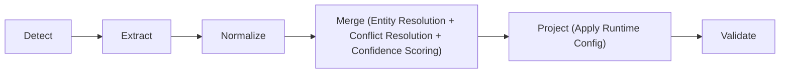

# Candidate Profile Transformer — Eightfold Take-Home

Transforms messy, multi-source candidate data (recruiter CSV exports, ATS
JSON blobs, GitHub profile data, free-text recruiter notes) into one clean,
canonical, deduplicated, fully-traceable profile per candidate — with a
runtime-configurable output projection layer.

## Pipeline



Each stage lives in its own module under `src/`:

| Stage | Module | Responsibility |
|---|---|---|
| 1. Detect | `src/detector.py` | Classify each input file's source type (extension + content sniffing) |
| 2. Extract | `src/extractors/*.py` | Pull raw values into a partial `CanonicalProfile`, one extractor per source type |
| 3. Normalize | `src/normalizers.py` | Pure functions: phones → E.164, dates → YYYY-MM, countries → ISO-3166 alpha-2, skills → canonical names |
| 4. Merge | `src/merger.py` | Entity resolution (which partial profiles are the same person) + field-level conflict resolution + confidence scoring |
| 5. Project | `src/projector.py` | Reshape the canonical record per the runtime config — rename/subset fields, toggle confidence, choose missing-value policy |
| 6. Validate | `src/validator.py` | Check the projected output against the requested schema before returning |

`src/pipeline.py` orchestrates all of the above. `src/cli.py` is the input/output surface.

## How to run (Docker — recommended, works on any machine)

No Python setup required — just Docker. One `Dockerfile`, all source code
copied into the image at build time, with a **persistent volume** for
output so results accumulate across runs instead of disappearing when a
container exits.

```bash
git clone <your-repo-url>
cd eightfold

docker build -t profile-forge .
docker run --rm -v "$(pwd)/output:/app/output" profile-forge
```

`-v profile-forge-output:/app/output` creates (or reuses) a named Docker
volume that lives independently of any single container — so running the
container again, even after `--rm` removes the previous container, still
writes into the same persistent storage and previous output files are
still there.

**To see what's in the persistent volume** (e.g. to copy results out to
your host filesystem):

```bash
docker run --rm -v profile-forge-output:/app/output -v "$(pwd)/output:/host_output" profile-forge sh -c "cp -r output/* /host_output/"
```

Or, more simply, bind the volume directly to a host folder instead of a
named volume — this is the easiest way to just see the JSON output land
on your machine directly:

```bash
docker run --rm -v "$(pwd)/output:/app/output" profile-forge
```

**To run with a custom config or different inputs**, override the
container's default command:

```bash
docker run --rm -v "$(pwd)/output:/app/output" profile-forge python3 -m src.cli run --input sample_inputs/recruiter_export.csv sample_inputs/ats_blob.json sample_inputs/github_profiles.json sample_inputs/recruiter_notes.txt --config sample_inputs/custom_config_example.json --output output/custom_profiles.json --pretty
```

**To run the test suite inside the container:**

```bash
docker run --rm profile-forge python3 -m pytest tests/ -v
```

**To run on your own data**, mount a local directory containing your files
into the container and point `--input` at it:

```bash
docker run --rm -v "$(pwd)/output:/app/output" -v "/path/to/your/data:/app/my_inputs" profile-forge python3 -m src.cli run --input my_inputs/your_file.csv my_inputs/your_ats.json --output output/result.json --pretty
```

### When you change the source code

Docker images are immutable snapshots of the source at build time — a
container does not see edits you make on your host after the image was
built. To pick up a code change, **rebuild and run again**:

```bash
docker build -t profile-forge .
docker run --rm -v profile-forge-output:/app/output profile-forge
```

Because `requirements.txt` is copied and installed in its own layer
*before* the rest of the source code is copied (see the Dockerfile), Docker
reuses its cached dependency-install layer as long as `requirements.txt`
itself hasn't changed — so a rebuild after only editing a `.py` file is a
few seconds, not a full reinstall. The persistent volume means each
rebuild+run cycle's output accumulates rather than wiping out the
previous run's results.

This was verified end-to-end before being handed off: dependency install
from `requirements.txt` in a clean environment, the exact container `CMD`
producing correct output, and output correctly accumulating across
multiple simulated runs against the same storage path — so behavior is
identical on any machine with Docker installed, no local Python version
or dependency conflicts.

## How to run (without Docker)

```bash
pip install -r requirements.txt

# Default schema, all 4 sample sources:
python3 -m src.cli run --input sample_inputs/recruiter_export.csv sample_inputs/ats_blob.json sample_inputs/github_profiles.json sample_inputs/recruiter_notes.txt --output output/default_profiles.json --pretty --summary

# Custom config (field rename/remap, projection — the "required twist"):
python3 -m src.cli run --input sample_inputs/recruiter_export.csv sample_inputs/ats_blob.json sample_inputs/github_profiles.json sample_inputs/recruiter_notes.txt --config sample_inputs/custom_config_example.json --output output/custom_profiles.json --pretty
```

`--summary` prints a JSON summary (candidates found, sources processed,
sources skipped, validation failures) to stderr — useful for the demo
video and for sanity-checking a run.

## Run the tests

```bash
pip install pytest
python3 -m pytest tests/ -v
```

62 tests across 4 files: `test_normalizers.py` (pure-function unit tests),
`test_merger.py` (entity resolution + field-merge policy), `test_projector.py`
(runtime config behavior — directly exercises the exact example config from
the problem statement), `test_pipeline.py` (end-to-end + a gold-profile
comparison for the hardest entity-resolution edge case + 6 dedicated
robustness/garbage-input tests).

## Sample inputs

`sample_inputs/` contains one structured source from each required group
plus both unstructured sources, all describing 2–3 overlapping fictional
candidates so the merge/dedup logic has real cross-source conflicts to
resolve:

- `recruiter_export.csv` — structured, recruiter CSV (name/email/phone/company/title)
- `ats_blob.json` — structured, ATS export with field names that deliberately
  do NOT match our canonical schema (`applicant_name`, `contact_email`,
  `mobile`, `org`, `role`, etc.) — exercises the field-remapping logic
- `github_profiles.json` — unstructured, shaped like a GitHub REST API
  response (see "Assumptions" below for why this is a local file, not a
  live API call)
- `recruiter_notes.txt` — unstructured, free-text recruiter call notes for
  two candidates, separated by `---`
- `custom_config_example.json` — the exact config from the problem
  statement's "Example config" block
- `config_omit.json`, `config_error.json` — configs that exercise the
  `on_missing: "omit"` and `on_missing: "error"` policies respectively

## Key design decisions (see code comments for full reasoning)

**Entity resolution (which records are the same person):** email match →
phone match → name match, in that priority order. Demonstrated on Raunit's
profile, which appears under TWO DIFFERENT emails across sources (Gmail in
the CSV/notes, an institutional email in the ATS blob) — they only converge
into one candidate because of a shared phone number. This is asserted
explicitly in `test_pipeline.py::test_gold_profile_raunit_full_merge`.

**Field-level conflict resolution:**
- Scalar fields (name, headline, location, years_experience): source-priority
  ranking `ats_json > recruiter_csv > recruiter_notes > github_api`, with a
  majority-vote override if 2+ sources independently agree on a different
  value than the top-priority source.
- List fields (emails, phones, skills): UNION + dedup, never pick-a-winner —
  multiple emails/phones/skills are complementary information, not conflicts.
- List-of-records fields (experience, education): dedup by (company, title) /
  (institution, degree), keeping the most date/summary-complete entry.

**Confidence scoring:** per-skill confidence is corroboration-boosted (more
independent sources mentioning the same skill → higher confidence, capped at
1.0), never corroboration-penalized. `overall_confidence` is a weighted
average across only the *populated* top-level fields — an honestly-empty
field is excluded from the average rather than counted as a strike, per the
problem statement's own "wrong-but-confident is worse than honestly-empty"
principle.

**Projection / runtime config (the required twist):** a small JSON-path-like
mini-language (`field`, `field[0]`, `field[].subfield`) resolves `"from"`
paths against the canonical record's dict form. Three `on_missing` policies
(`null`/`omit`/`error`) are fully implemented and tested. The projector never
mutates the canonical record — it's a pure `(profile, config) -> dict`
function, fully decoupled from merge logic.

## Assumptions & scope decisions

- **GitHub extractor reads a local JSON file shaped like the GitHub REST
  API response**, rather than making a live HTTP call. The extraction
  *logic* is identical either way — only the I/O (file read vs. HTTP GET)
  would change in a production version with network access. This was a
  deliberate scope decision to keep the submission self-contained and
  deterministic without depending on network availability or GitHub rate
  limits during grading.
- **Recruiter notes parsing uses regex on a loosely labeled free-text
  format** (`Label: value` lines + prose), not an LLM call. This was a
  deliberate choice for determinism — "same inputs produce the same
  output" is an explicit requirement, and an LLM call (even at temperature
  0) doesn't give the same hard guarantee, plus it adds external dependency,
  cost, and latency. The tradeoff is that genuinely free-form prose with no
  labels at all yields a sparse profile — this is intentional: an
  honestly-incomplete extraction beats an invented one.
- **Entity resolution falls back to name-only matching as a last resort**
  when no email/phone signal is available. This is a known, documented
  false-positive risk for common names (two different "Jane Doe"s with
  no other signal would incorrectly merge) — see
  `test_merger.py::test_different_emails_same_name_form_separate_clusters_when_no_other_link`,
  which exists specifically to make this tradeoff explicit rather than
  silently leave it untested. A production system would likely add a
  human-review queue for name-only matches rather than auto-merging them.
- **Phone number region defaulting**: when a phone number has no country
  code, we default to region "US" unless source context says otherwise
  (the ATS extractor doesn't currently pass a region hint based on
  `location_country` — noted as a possible future improvement, currently
  descoped since none of our sample phone numbers without a `+` prefix
  needed this).
- **No live network calls anywhere in the pipeline** — by design, for
  determinism and to keep grading reproducible without external
  dependencies or credentials.

## What was deliberately left out (under time pressure)

- Resume PDF/DOCX extraction (one of the two allowed "pick at least one"
  unstructured sources) — we implemented GitHub + recruiter notes instead,
  which already satisfies "at least one unstructured source," and chose
  breadth (4 of 6 possible source types, hitting both required groups
  multiple times over) rather than also building a PDF text-extraction
  extractor, which would mostly duplicate the same regex-on-prose pattern
  already demonstrated in `notes_extractor.py`.
- LinkedIn extraction — LinkedIn's API/scraping access is heavily
  restricted; GitHub's public API makes for a more realistic and testable
  stand-in for "unstructured source with a public API."
- A UI — the problem statement explicitly deprioritizes this in favor of
  a CLI ("a clean CLI is completely sufficient").
- Fuzzy/phonetic name matching (e.g. Jaro-Winkler) for entity resolution —
  exact-normalized matching only. Noted as a known limitation above.
